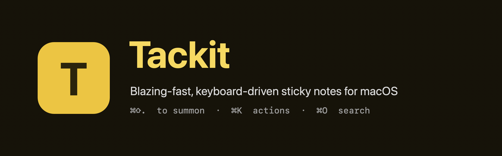

<p align="center">
  
</p>

# Tackit

An extremely fast, keyboard-driven, local-first note app for macOS — Apple Stickies ergonomics with a modern editor. Pin a thought in under a second, keep it always-on-top, never lose it.

> Status: **M1 — local MVP.** Notes persist as plain Markdown files, full-text search, a ⌘K action menu, per-note metadata, and configurable shortcuts. Cloud sync and iOS come later (see `docs/03-roadmap.md`).

## Features

- **Global hotkey** (default **⌘⇧.**, rebindable) shows/hides your floating, always-on-top stickies.
- **Borderless Stickies-style windows** — no chrome; per-note size and position persist.
- **Markdown editor** (TipTap/ProseMirror in a pooled WKWebView); notes are stored as **Markdown + YAML frontmatter** files you can edit in any editor.
- **⌘K action menu** — configure note, search, new, close, delete (confirm + undo).
- **⌘O in-sticky search** across all notes; **⌘E** metadata (icon, title, description, group typeahead, tags).
- **Settings** — default size, 3×3 placement, always-on-top, open-at-login, and rebindable shortcuts.
- **⌘1–9** to jump between open stickies (AZERTY-safe).

## Install

Once a tap is published:

```sh
brew install --cask tackit
```

Or download the signed `.dmg` from [Releases](../../releases) and drag Tackit to Applications. It runs as a menu-bar agent (📌) with no Dock icon.

## Build from source

Requirements: macOS 14+ (Apple Silicon), the Xcode 26 toolchain (`swift`), Node 20+ and `pnpm`.

```sh
./scripts/run.sh      # build editor bundle + Swift app, assemble the .app, launch it
```

Then press **⌘⇧.** to open a sticky. See `docs/05-interaction-and-keymap.md` for the full keymap.

## Test

```sh
swift test                 # TackitCore units (frontmatter, store, search, models)
cd editor && pnpm test     # md↔ProseMirror golden + fuzz + sanitization (vitest)
```

CI runs both on every push/PR (`.github/workflows/ci.yml`).

## Package & release

```sh
./scripts/package.sh       # release .app + .dmg (signs + notarizes when creds are set)
```

See `docs/08-packaging-and-release.md` for signing, notarization, and the Homebrew cask.

## Layout

```
Sources/TackitCore ... UI-agnostic core: models, document format, note store, search
Sources/TackitApp .... macOS app: window/panel layer, editor surface, ⌘K/overlays, settings, hotkey
editor/ .............. TypeScript + TipTap editor bundle (esbuild) + vitest
Tests/ ............... TackitCore unit tests
packaging/ ........... Info.plist, entitlements, icon, Homebrew cask
docs/ ................ product + engineering docs (research, PRD, roadmap, architecture, interaction, plan)
```

## Contributing

See [CONTRIBUTING.md](CONTRIBUTING.md). Product/UX decisions require the owner's sign-off — read the "Product decisions" rule in `CLAUDE.md` first.

## License

MIT — see `LICENSE`.
