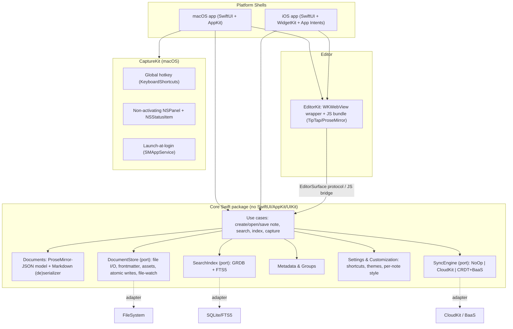

# 04 — Architecture & Tech Stack

**Codename:** blazing-fast-memo
**Author:** Software Architect
**Date:** 2026-08-10
**Status:** Proposed (v1)

> Scope: a fast, keyboard-driven, local-first, open-source note app. Native Apple first (SwiftUI), macOS before iOS, distributed via Homebrew / direct download (not the App Store), solo Swift developer. Sync sequenced: Phase 1 local-only → Phase 2 CloudKit → Phase 3 managed E2E freemium backend.

This document is opinionated. Where the brief's ambitions collide with reality (rich colors/tables in "plain markdown", CRDT sync of rich documents), I name the trade-off explicitly instead of pretending it away.

---

## 0. TL;DR — the recommended path

| Decision | Recommendation | One-line why |
|---|---|---|
| **Editor engine** | Embedded web editor — **ProseMirror (via TipTap)** in a **pre-warmed `WKWebView`** | Only realistic way a solo dev ships tables + colors + inline images + WYSIWYG markdown, and it reuses on every future platform. |
| **Storage format** | **Markdown (GFM + documented extensions) + YAML frontmatter + per-note assets folder** as canonical files; **ProseMirror JSON** as the runtime model; **SQLite/FTS5 (GRDB)** as a derived index | Portable, human-readable, git-diffable; the index makes unlimited notes searchable without scanning files. |
| **Core/UI split** | A platform-agnostic **`Core` Swift package** (no SwiftUI/AppKit/UIKit) behind ports; thin SwiftUI shells per platform | Hexagonal separation so iOS and later platforms reuse the same domain, store, search, and sync. |
| **Global hotkey** | `NSStatusItem` accessory app + **KeyboardShortcuts** (Sindre Sorhus) + non-activating `NSPanel`; launch-at-login via **`SMAppService`** | Proven, no Accessibility permission needed, instant floating capture. |
| **Multi-note** | Native **`WindowGroup` multi-window + macOS window tabbing**, plus in-window `NavigationSplitView` for 2-up | Get tabs/windows/panes mostly for free; least code for a solo dev. |
| **Search/metadata** | **GRDB + SQLite FTS5**, files are source of truth, index is a derived cache | Fast prefix/phrase search + ranking at 10k+ notes; full control. |
| **Sync** | P1 no-op → P2 **CKSyncEngine** (iCloud private DB) → P3 **BaaS as encrypted-blob transport + CRDT** (Yjs/`y-prosemirror` + native bindings) | Match effort to phase; defer the genuinely hard CRDT+E2E work. |
| **Distribution** | Developer ID sign + notarize (`notarytool`) → `.dmg` → **Homebrew cask (personal tap)** + **Sparkle 2** EdDSA auto-update | Standard 2026 indie macOS pipeline; no App Store constraints. |

The one uncomfortable truth up front: **"native Apple first" does not require a native text engine.** The app *shell* (capture, windows, menu bar, widgets, Siri, sync, search) is fully native Swift; only the *text-editing surface* is web-based, because that is exactly the component where native TextKit is weakest and where cross-platform reuse pays off most.

---

## 1. Editor engine — the central decision

### 1.1 What the feature set actually demands

The editor must deliver, as-you-type: markdown shortcuts (`##` → H2), **tables**, **text color + highlight**, **inline pasted images**, rich/short **link preview cards**, and **per-note styling**. That is a WYSIWYG rich-text editor with a markdown *feel*, not a plain text view.

### 1.2 Options compared

| Criterion | (a) Native TextKit 2 (`NSTextView`/`UITextView`) | (b) Web editor in `WKWebView` (ProseMirror/CodeMirror/Lexical) | (c) Hybrid (native quick-box + web full editor) |
|---|---|---|---|
| Typing/perf feel | Excellent, native | Excellent once warm; **cold-start latency is the risk** | Native feel for capture, web for edit |
| Colors / highlight | Easy (`NSAttributedString` attrs) | Easy (extensions) | Mixed |
| **Tables** | **Painful.** `NSTextTable` is AppKit-only, buggy, no UIKit equivalent → breaks iOS reuse | Solved by libraries | Solved on web side only |
| Inline images | Doable via `NSTextAttachment`, fiddly layout/resize | Solved (native web behavior) | Mixed |
| Rich link cards | Custom attachment views, a lot of work | Node view / decoration, straightforward | Web side only |
| Markdown-as-you-type | Build it yourself (parser + attributes) | Built-in input rules (TipTap) or decorations (CodeMirror) | Duplicated logic |
| **Cross-platform reuse** | **Poor** — AppKit vs UIKit diverge; nothing reuses beyond Apple | **Excellent** — same JS bundle on macOS, iOS, and later Windows/Linux/web | Partial; two editors to maintain |
| Effort for a **solo dev** | Very high (you are rebuilding a rich editor) | Moderate (compose mature libraries) | Highest (two editors, two formats) |
| Native keyboard/IME | Best | Good but needs care (IME, shortcuts, focus) | Mixed |

Verified reality on the native path: TextKit 2 has matured but still carries sharp edges — e.g. `NSTextView` can silently downgrade to TextKit 1 if you touch `.layoutManager`, and printing/thumbnails were unsupported before macOS 15 (Michael Tsai, "TextKit 2: The Promised Land", Aug 2025). Meta's **lexical-ios** (native Swift on TextKit) is explicitly *pre-release, no support guarantee*, last PR merged ~6 months ago — not a foundation to bet a product on.

### 1.3 Recommendation (firm)

**Build a single editor: ProseMirror (wrapped by TipTap) running in a persistent, pre-warmed `WKWebView`, exposed to Swift behind an `EditorSurface` protocol.**

Why ProseMirror/TipTap over the alternatives inside option (b):
- **ProseMirror** gives a strict, schema-validated document model that serializes cleanly to markdown+extensions — critical for our storage and sync story.
- **TipTap** provides, out of the box: markdown input rules (`##`→H2), tables, images, `color`/`highlight` marks, link handling, node views for rich link cards.
- **CodeMirror 6** is the alternative if the founder decides the product is really a *source-markdown* editor (Obsidian/Typora feel) rather than WYSIWYG — it is the fastest option for huge plain-text docs, but tables/colors/image blocks become manual widget/decoration work. Keep it as a fallback, not the primary.
- **Lexical (web)** is excellent but its data model is less markdown-native than ProseMirror; more serialization work for us.

Handling the "blazing fast" pillar (this is the main risk of going web):
- > **Superseded by the Stickies model — see [Addendum 2026-08-10 §A.1](#addendum-2026-08-10--stickies-style-window-model).** A single webview no longer suffices; the recommendation is now a **hot pool of K live webviews + native snapshots for inactive sticky windows**.
- Keep **one long-lived, hidden, already-loaded `WKWebView`** warm from launch. The global-hotkey panel *reveals and focuses* it; it never cold-starts on capture.
- Ship the JS bundle **locally** (in-app resource, `loadFileURL`), no network, no CDN.
- Keep the bundle lean; lazy-load heavy extensions (tables, image handling) after first paint.
- Add a CI performance gate on **first-keystroke latency** and **typing latency at large doc sizes**.

> ADR-001 and ADR-002 at the end of this document capture this decision and its consequences formally.

### 1.4 What stays native (so "native first" is honest)

Global hotkey, menu bar, capture panel, window/tab management, settings, search UI, file I/O, iCloud sync, WidgetKit widgets, App Intents/Siri — all SwiftUI/AppKit/UIKit. The webview is one component behind one protocol.

---

## 2. Document / storage format

### 2.1 The hard trade-off, stated plainly

- **Text color, highlight, per-note background/font, and rich link cards are not expressible in standard CommonMark.** GFM covers tables; it does *not* cover inline color or per-note style.
- A **pure block/AST JSON** model (e.g. raw ProseMirror doc) captures everything perfectly but is not portable, not human-readable, not git-diffable, and locks users in — which is hostile to an open-source, local-first ethos.
- **Plain `.md`** is maximally portable but *loses* colors, highlights, per-note style, and link-card richness.

You cannot get "fully rich" and "pure portable markdown" simultaneously. The compromise below keeps files portable and readable while degrading gracefully.

### 2.2 Options compared

| Criterion | Plain `.md` | **MD + YAML frontmatter + assets/ (recommended)** | Rich block/AST JSON |
|---|---|---|---|
| Portability | Best | Good (frontmatter is a de-facto standard) | Poor |
| Human-readable / git-diff | Best | Good | Poor |
| Colors / highlight | ✗ | ✓ via inline HTML `<mark>` / `<span style>` (degrades gracefully) | ✓ native |
| Tables | ✓ (GFM) | ✓ (GFM) | ✓ |
| Per-note style (font/bg/theme) | ✗ | ✓ in frontmatter | ✓ |
| Inline images | ✓ (relative paths) | ✓ (assets folder, relative paths) | ✓ (embedded/base64 — bloats) |
| Search/index | scan (slow) | index the file + frontmatter | index the JSON |
| CRDT-friendliness | poor (line merges) | poor at char level (see §7) | better, but not free |

### 2.3 Recommendation (firm)

**Canonical on disk = one Markdown file per note (CommonMark + GFM tables + `==highlight==` + a small, documented inline-HTML subset for color) + YAML frontmatter for metadata and per-note style + a co-located `assets/` folder for pasted images.** The **runtime authoritative model is ProseMirror JSON**; it serializes to this markdown on save and parses back on open. A **SQLite/FTS5 index (GRDB) is a derived cache**, never the source of truth.

Concrete conventions:
- **Metadata** (created, updated, description, icon, group/folder id, note id) → **frontmatter**. Stable UUID as the note's identity, independent of filename/path (so renames and moves don't break links or sync).
- **Per-note style** (font size, background color, theme) → **frontmatter** (e.g. `style: { fontSize: 16, background: "#faf3e0", theme: "sepia" }`).
- **Highlight** → extended markdown `==text==` (widely supported).
- **Text color** → inline HTML `<span style="color:#c0392b">text</span>`. This is the deliberate compromise: it is not "pure" markdown, but markdown *is a superset of HTML*, so it renders in most tools and stays human-readable and diffable.
- **Images** → written as files into `assets/`, referenced by **relative path**; never base64-embedded (keeps files small and diffs sane). Store by content hash to dedupe.
- **Rich link cards** → stored as a normal markdown link plus a fenced/HTML block cache of the unfurled metadata (title, description, cached OG image in `assets/`), so the file still works if the cache is stripped.

Example note file:

```markdown
---
id: 0A6C1F1E-...-9B2
title: Kickoff notes
created: 2026-08-10T09:12:03Z
updated: 2026-08-10T10:04:55Z
description: Sprint 0 planning
icon: "🚀"
group: work/planning
style: { fontSize: 16, background: "#0e1116", theme: "dark" }
---

## Agenda

- ==decide editor engine==
- <span style="color:#e67e22">open question:</span> CRDT vs LWW

| Item | Owner |
|------|-------|
| Editor | Guillaume |


```

Directory layout (Phase 1):

```
NotesLibrary/
  notes/
    0A6C1F1E-….md
    2B7D…​.md
  assets/
    8f3a…c1.png
  .index/
    memo.sqlite        # derived FTS5 index; safe to delete & rebuild
```

Store this in Application Support by default, with an option to point at a user folder (or later iCloud Drive). The `.index/` DB is disposable and rebuildable from files — this keeps files as the single source of truth.

---

## 3. Overall architecture

### 3.1 Principle

Hexagonal (ports & adapters). A pure `Core` Swift package holds domain + use cases and depends on **nothing** platform-specific. Delivery mechanisms (SwiftUI, AppKit panels, WebKit editor, WidgetKit, CloudKit, the filesystem) are **adapters** plugged into **ports**. This is justified here — not architecture astronautics — precisely because the brief requires reusing the core on iOS and later other platforms, which only works if the core is free of framework coupling.

### 3.2 Package / module map



### 3.3 Ports (protocols) defined in Core, implemented by adapters

- `DocumentStore` — CRUD on notes + assets; emits change events. Adapter: `FileSystemStore` (atomic writes, FSEvents/`DispatchSource` watch).
- `SearchIndex` — index(note), search(query) → ranked hits. Adapter: `GRDBSearchIndex`.
- `SyncEngine` — push/pull/observe. Adapters: `NoOpSync` (P1), `CloudKitSync` (P2), `CRDTSync` (P3).
- `EditorSurface` — load doc, apply command, observe changes, serialize. Adapter: `WebKitEditor` (WKWebView + `WKScriptMessageHandler` bridge).
- `HotkeyService` / `CapturePresenter` — macOS-only adapters over KeyboardShortcuts + NSPanel.

### 3.4 Dependency rules

- Core imports no UI, no WebKit, no CloudKit, no GRDB-in-the-domain (GRDB lives in the adapter; the domain sees the `SearchIndex` port).
- Controllers/views never call the filesystem or SQLite directly — they go through use cases. Direct repository access from a view is an architectural smell.
- The JS editor is dumb about persistence: it knows the doc model and emits change events; Swift owns saving, indexing, and sync.

This split is what lets the iOS app (Phase 2) and any later platform reuse Documents/Store/Search/Metadata/Settings/Sync unchanged, swapping only the shell and the capture adapter.

---

## 4. macOS global hotkey + fast capture

### 4.1 App shape

Menu-bar **accessory app**: `NSStatusItem` in the menu bar; set `LSUIElement`/`Application is agent (UIElement)` so there's no Dock icon by default (with a preference to show a main window). Because we ship outside the App Store, we are **not** in the sandbox and can use global hotkeys and, if ever needed, Accessibility APIs.

### 4.2 Global shortcut registration

Use **KeyboardShortcuts** by Sindre Sorhus (v2.4.0, verified current Aug 2026; used in production by Dato/Plash/etc.). It provides user-customizable global shortcuts with a ready-made SwiftUI recorder view — which directly satisfies the **customizable shortcuts** requirement. Under the hood it uses Carbon `RegisterEventHotKey`, so a plain global hotkey works **without** Accessibility or Input-Monitoring permission. Alternative: the older `HotKey` library or rolling your own Carbon/`CGEventTap`; KeyboardShortcuts wins on the built-in recorder + customization UI, saving the solo dev real work.

### 4.3 Instant capture window

> **Revised by the Stickies model — see [Addendum 2026-08-10 §A.2 and §A.5](#addendum-2026-08-10--stickies-style-window-model).** Capture now summons a per-note floating sticky (borderless, always-on-top, non-activating panel) served from the webview pool, rather than one shared capture panel.

- Present an **`NSPanel`** with the `.nonactivatingPanel` style, `level = .floating`, `collectionBehavior` including `.canJoinAllSpaces`/`.moveToActiveSpace` and `.fullScreenAuxiliary`, and `hidesOnDeactivate`. Set `becomesKeyOnlyIfNeeded`/allow it to become key so the user can type immediately without fully activating the app or disturbing the frontmost app's window stack.
- On hotkey: reveal the panel centered, focus the **pre-warmed WKWebView editor**, create a new note buffer. First keystroke is instant because the webview is already loaded (see §1.3).
- Dismiss on `Esc` or blur → save + index. Toggle behavior on repeated hotkey press.
- Keep the panel and the editor separate from the "main library window" so capture is never blocked by heavier UI.

### 4.4 Launch at login

Use **`SMAppService.mainApp`** (macOS 13+), the modern replacement for the deprecated `SMLoginItemSetEnabled`/login-item helper. Expose a simple toggle in Settings.

---

## 5. Multi-note viewing

> **Superseded by the Stickies model — see [Addendum 2026-08-10 §A.2–A.4](#addendum-2026-08-10--stickies-style-window-model).** Multi-note is now independent borderless floating sticky windows (⌘+number to switch, most-recent-on-top), not `WindowGroup` tabs + split panes.

| Approach | Fit | Notes |
|---|---|---|
| **Multiple windows** (`WindowGroup` + `openWindow`) | **Primary** | macOS gives native **window tabbing** (⌘⇧\ to merge into tabs) for free, plus Stage Manager / Mission Control. Least custom code. |
| **In-window split** (`NavigationSplitView` / `HSplitView`) | **Secondary** | Side-by-side 2-up compare within one window; sidebar for groups/folders. |
| Custom tab bar | Avoid initially | Rebuilds what macOS window tabbing already does; more code, more bugs for a solo dev. |

**Recommendation:** lean on native `WindowGroup` multi-window + built-in macOS window tabbing for "windows/tabs", and `NavigationSplitView` for "panes". This covers the brief's "panes/tabs/windows" with minimal bespoke code. On iOS, use tabs/navigation stacks and (iPad) `NavigationSplitView`. Model a note window around the stable note **UUID**, not a file path, so moves/renames don't orphan windows.

---

## 6. Search & metadata indexing

**Recommendation: GRDB.swift + SQLite FTS5.** Files remain the source of truth; the SQLite DB in `.index/` is a derived, rebuildable cache.

- **Schema:** a `notes` table (id, path, title, created, updated, description, icon, group, plain-text body) + an **FTS5** virtual table (external-content, mirroring `notes`) with `unicode61` + optionally `porter` tokenizer; query with **bm25** ranking and prefix matching for as-you-type search.
- **Indexing:** incremental on each save; a file-watch (FSEvents/`DispatchSource`) reconciles external edits (since files are portable, users may edit them elsewhere). If the DB is missing/corrupt, rebuild from files.
- **Why not the alternatives:** Core Data/SwiftData make FTS awkward and hide SQL you'll want; a plain-file scan doesn't hold up at "unlimited notes"; CoreSpotlight is great for *system-wide* search but not for the in-app instant-search UX. (Optionally *also* donate items to **CoreSpotlight** later for system search — cheap bonus, not the primary index.)
- GRDB's FTS5 support is mature and current (verified Aug 2026); Apple's system `libsqlite3` ships with FTS5 enabled, so no custom SQLite build is required.

Metadata lives in frontmatter (canonical) and is mirrored into the index for fast filtering by group, date, icon, etc.

---

## 7. Sync architecture across the three phases

### 7.1 Phase 1 — local only

`SyncEngine = NoOpSync`. Files on local disk (optionally a user-chosen folder). Nothing to build beyond the store. Keep the door open by abstracting persistence behind the `DocumentStore` and `SyncEngine` ports from day one.

### 7.2 Phase 2 — CloudKit (Apple-only, macOS ↔ iOS)

**Recommendation: `CKSyncEngine` against the user's iCloud private database.** (Verified: introduced WWDC23, available iOS 17 / macOS 14+ — so Phase 2 sets a macOS 14 / iOS 17 floor; acceptable.)

- **Model:** each note → one `CKRecord` carrying metadata fields + a `CKAsset` for the markdown file; each image → a content-addressed `CKAsset`. `CKSyncEngine` handles change tokens, batching, retries, and push notifications; you own the record↔file mapping.
- **Conflicts:** for a single user on 2–3 devices, true conflicts are rare. Use server change tokens + **last-writer-wins on the note record**, and write a **conflict copy** (`note (conflicted 2026-08-10).md`) when both sides changed since the last common version, rather than silently losing data. This is honest and cheap; do **not** attempt CRDT here.
- **Why not `NSPersistentCloudKitContainer`:** it ties the whole store to Core Data, which fights our file-canonical model. `CKSyncEngine` gives control without that lock-in.
- **Requirements/risks:** iCloud + Push entitlements; syncs only on real devices (simulators can't register for remote notifications); needs a paid iCloud account on the user's side. E2E-ness is Apple-managed (stronger if the user has Advanced Data Protection).

### 7.3 Phase 3 — managed, E2E-encrypted, cross-platform, monetizable

This is where the ambitions get genuinely hard. Two independent hard problems: **(A) a backend + E2E encryption**, and **(B) conflict-free merge of rich documents**.

**(A) Backend — don't roll your own auth/storage.** The server should only ever see **ciphertext + minimal routing metadata**.

| Option | Verdict for a solo dev |
|---|---|
| Roll-your-own (Postgres + object store + auth) | Most control, most ops burden. Avoid at first. |
| **Supabase** (managed Postgres + Auth + Storage + Realtime, RLS) | **Recommended default** for a monetizable, scalable cross-platform backend; store encrypted blobs, use Realtime for change signaling. |
| **PocketBase** (single Go binary, SQLite) | Cheapest to self-host to validate the market; graduate to Supabase if it takes off. |
| Turso / libSQL (edge SQLite, embedded replicas) | Interesting for local-first SQLite replication, but you'd still sync ciphertext; less proven for this exact shape. |
| Appwrite | Viable BaaS; larger to self-host than PocketBase. |

**E2E encryption:** encrypt per-note content client-side. Per-note content key, wrapped by a user root key derived from a passphrase (**Argon2id**) and/or held in Keychain/Secure Enclave; symmetric encryption via **CryptoKit** (AES-GCM) or libsodium (XChaCha20-Poly1305). The server stores opaque blobs. **The hardest part is key management/recovery UX** — lose the passphrase and the data is unrecoverable; you'll need a deliberate recovery-key flow.

**(B) CRDT for rich documents — the top technical risk.** Honest assessment:
- CRDTs shine for **text and simple structure**. **Large binary assets (pasted photos) must NOT live in the CRDT** — sync them as content-addressed encrypted blobs and let the CRDT carry only the reference/hash.
- Tables and nested blocks map onto the ProseMirror document, which has battle-tested CRDT bindings.

| CRDT option | Fit here |
|---|---|
| **Yjs + `y-prosemirror`** (JS) with native Swift bindings (`yswift`/Y-CRDT) | **Recommended.** Our editor is already ProseMirror; `y-prosemirror` is *the* most production-proven ProseMirror collaboration binding. `yswift` wraps the Rust `yrs` for native access. Compact binary updates. |
| **Automerge / automerge-swift** (v0.7.2, Dec 2025, active but pre-1.0) | Strong cross-language story (v3 columnar storage, big memory/size wins) and has rich-text support; ProseMirror binding is less battle-tested than `y-prosemirror`. Solid alternative. |
| Pure Swift-native CRDT | Not mature enough for rich docs; don't bet the product on it. |

**Resolving the file-vs-CRDT contradiction (important):** you cannot have *both* "markdown files are the source of truth" *and* "a CRDT is the source of truth." The clean framing: the **ProseMirror JSON doc is the runtime authoritative model throughout**. In Phases 1–2 it is *persisted* as portable markdown+frontmatter+assets. In Phase 3 you additionally persist/sync a **Yjs update log per note** as the merge truth, and markdown becomes the **portable export/local mirror regenerated from the CRDT**. Abstract this behind the `DocumentStore`/`SyncEngine` ports from day one so Phase 3 is a new adapter, not a rewrite.

**Hardest risks in sync (call-outs):**
1. CRDT merge of *rich* structure (tables, nested blocks, per-note style) has real edge cases; scope the CRDT to text + block structure and treat images/large assets as atomic content-addressed blobs.
2. E2E key management/recovery is a first-class product problem, not a checkbox.
3. The storage-truth pivot (files → CRDT) between P2 and P3 must be designed for now, even though it ships later.

---

## 8. Packaging & distribution

Pipeline (standard 2026 indie macOS, verified):

1. **Sign** with a **Developer ID Application** certificate, **hardened runtime** enabled, minimal entitlements.
2. **Notarize** with `notarytool`, then **staple** the ticket. Ship as a **`.dmg`** (or `.zip`) for direct download.
3. **Homebrew cask** in a **personal tap** first (e.g. `homebrew-blazing-fast-memo`). Homebrew's official cask repo has notability/acceptance criteria a brand-new app may not meet; a personal tap avoids that gate. The cask points at the notarized DMG URL + version + `sha256`.
4. **Auto-update: Sparkle 2.x** with **EdDSA (ed25519)** appcast signing (DSA-only is no longer supported). Host `appcast.xml` on GitHub Releases/Pages. Sparkle works alongside Developer ID + notarization.
5. **Cask ↔ Sparkle coexistence:** set `auto_updates true` in the cask so Homebrew doesn't fight Sparkle's in-app updates (otherwise `brew upgrade` and Sparkle can clobber each other).
6. **Versioning:** SemVer via `CFBundleShortVersionString` + a monotonic `CFBundleVersion` build number (Sparkle compares build numbers). Automate sign→notarize→appcast in CI (the notarization wait dominates; end-to-end ~10–15 min is typical).

For open-source distribution, also publish source + build instructions; keep signing keys (Developer ID + Sparkle EdDSA private key) in CI secrets, never in the repo.

---

## 9. Testing strategy & key risks

### 9.1 Testing (high level)

- **Core Swift package** (Swift Testing/XCTest): the **markdown ↔ ProseMirror-JSON round-trip** is the highest-value target — golden-file + property/fuzz tests to guarantee serialization stability (this underpins both portability *and* diff/sync sanity). Plus store, indexing, metadata, settings.
- **Editor JS** (vitest): TipTap schema, input rules (`##`→H2), serialization; **Playwright** for editor behavior headless.
- **Bridge/integration**: XCUITest for the capture flow — hotkey → panel → type → save → index → search.
- **Performance gates in CI**: first-keystroke latency (pre-warm), typing latency at large docs, search latency at 10k+ notes.
- **Sync harness**: simulated multi-device edits and conflict scenarios (LWW conflict-copy in P2; CRDT convergence in P3).

### 9.2 Top risks & mitigations

| # | Risk | Mitigation |
|---|---|---|
| 1 | **Web editor undercuts the "blazing fast"/instant-capture promise** (cold-start, IME, native feel) | Persistent pre-warmed `WKWebView`; local JS bundle; lean/lazy extensions; CI latency gates; CodeMirror-6 fallback path kept open. |
| 2 | **Rich features aren't portable markdown** (colors, per-note style, link cards) → fidelity/round-trip loss | Documented extension spec; frontmatter for style/metadata; inline-HTML for color that degrades gracefully; round-trip golden/fuzz tests. |
| 3 | **CRDT sync of rich docs + E2E key management (P3)** | Scope CRDT to text/structure; content-address blobs outside the CRDT; pick proven `y-prosemirror` + native bindings; prototype early; design key-recovery UX as a feature; keep the file→CRDT truth-pivot behind ports. |
| 4 | Solo-dev maintenance of a **dual-stack (Swift + JS)** codebase | Keep the JS surface small behind one `EditorSurface` protocol; shared bundle across platforms; strong CI on both sides. |
| 5 | Storage-model **pivot between file-canonical (P1/2) and CRDT-canonical (P3)** | Abstract persistence/sync behind ports from day one; ProseMirror JSON as the constant runtime truth. |

---

## Appendix A — ADR-001: Editor engine

**Status:** Proposed

**Context.** The product must deliver WYSIWYG rich editing (tables, text color/highlight, inline images, rich link cards, per-note style) with a markdown-as-you-type feel, on macOS then iOS then other platforms, built and maintained by a solo Swift developer. Native TextKit 2 is weakest exactly where the feature set is heaviest (tables have no cross-Apple story; rich attachments are laborious) and reuses poorly beyond Apple. A web editor solves richness and maximizes reuse but risks the "blazing fast"/instant-capture feel.

**Decision.** Use a single embedded web editor — **ProseMirror via TipTap in a pre-warmed `WKWebView`**, behind an `EditorSurface` Swift protocol. Keep everything else native. Keep **CodeMirror 6** documented as the fallback if the product pivots to source-markdown editing.

**Consequences.** *Easier:* tables/colors/images/link-cards/markdown-input-rules; cross-platform reuse; a clean doc model for storage/sync. *Harder:* a dual-stack (Swift + JS) codebase; must engineer around webview cold-start and IME to keep capture instant; native-feel details need care. *Mitigated by:* persistent pre-warmed webview, local bundle, CI latency gates.

## Appendix B — ADR-002: Storage format

**Status:** Proposed

**Context.** Files must be portable, human-readable, git-diffable and open (local-first, open-source), yet also carry colors, per-note style, tables, images, and be search-indexable and, eventually, sync-mergeable. No single representation is simultaneously "pure portable markdown" and "fully rich."

**Decision.** Canonical on disk = **Markdown (GFM + `==highlight==` + a small documented inline-HTML subset for color) + YAML frontmatter (metadata + per-note style) + per-note `assets/` folder**. Runtime authoritative model = **ProseMirror JSON**. Search = **derived SQLite/FTS5 (GRDB)** cache, rebuildable from files. In Phase 3, a per-note **Yjs update log** becomes the sync-merge truth with markdown as the portable export.

**Consequences.** *Easier:* portability, readability, diffs, indexing, graceful degradation of rich features. *Harder:* color/style rely on non-standard (but HTML-valid) markdown; round-trip fidelity must be tested rigorously; a genuine source-of-truth pivot (files → CRDT) awaits Phase 3. *Mitigated by:* golden/fuzz round-trip tests and persistence behind ports.

---

## Addendum 2026-08-10 — Stickies-style window model

> **Supersedes the single-webview and capture-panel assumptions.** The founder pivoted the interaction model after reviewing v1. Notes are now **Apple Stickies-style floating windows**, not a single capture panel + library window. This changes §1.3 (which assumed *one* pre-warmed `WKWebView`), §4.3 (single capture panel), and §5 (multi-note viewing). Read those sections through this addendum. Nothing about the Core package, storage format, search, or sync changes.
>
> **For the record (context, not architecture):** licence = **MIT**; **AI features are out of scope**.

### A.0 New product model (as given)

- Notes are **borderless** (no traffic lights), **always-on-top** floating windows, small (~380px wide default), opening **top-right** by default; **size + position persisted** per note across launches.
- Global hotkey **⌘⇧.** opens the **last-opened note** (not a blank note); rebindable.
- Multiple notes = **multiple independent floating windows**, each self-contained (no sidebar/header). Most-recently-opened/edited window on top. **⌘+number** switches windows. Search opens a note in the **current top window**; a separate hotkey opens it in a **new window**. (Multi-window ships at M3 but is designed for now.)
- Per-note icon shown inline; metadata edited inline in the window.

### A.1 WKWebView per window vs a pool — firm recommendation

The blocking constraint (verified Aug 2026): **`WKWebView` is multi-process** — each instance spins up its **own WebContent process** (WebCore + JSC); a single Networking process is shared across all. Memory is charged to those helper processes, not the app, so an over-budget web process goes blank rather than crashing the app — but it is still real RAM. Heavy web content can hit **200 MB+/instance**; our editor is a lean *local* bundle, so a realistic planning figure is **~60–120 MB per live editor** (base WebContent process + our content). **Measure this in M0** — do not trust the estimate.

**Do NOT run one live `WKWebView` per sticky.** Ten stickies × ~100 MB ≈ 1 GB of web-process RAM for a "small note" app — unacceptable.

**Recommended design — hot pool + native snapshot for inactive windows:**

1. **Hot pool of K live web editors**, default **K = 3** (configurable): the focused sticky + the 1–2 most-recently-used + always **one warm spare** already loaded with the editor bundle and a blank doc. All pooled webviews share **one `WKProcessPool`** (Apple's explicit guidance — a pool per webview inflates memory).
2. **Inactive sticky windows render a native snapshot**, not a live webview. On blur, capture the editor's rendered output as a lightweight native view (`NSAttributedString`/`NSTextView` render, or a bitmap snapshot) costing ~1–5 MB, release the webview back to the pool.
3. **Rehydrate on focus**: when an inactive sticky is focused, take a webview from the pool (recycling the least-recently-used if the pool is full), load that note's ProseMirror doc (local, instant), swap it in behind the snapshot, focus. The snapshot stays visible until the webview paints, so there's no flash.
4. **Capacity:** support **~10–12 simultaneous sticky windows** comfortably (K live + the rest as snapshots). Beyond that, keep recycling — never exceed K live webviews. If a user opens dozens, they still only ever cost K web processes.

Net: **K = 3 live web editors, snapshot the rest, LRU-recycle**; RAM for editors stays ~200–360 MB regardless of how many stickies are open. This is the single most important change from v1.

### A.2 Window layer — NSPanel, borderless, always-on-top

**Use `NSPanel` (subclass), not plain `NSWindow`.** `NSPanel` gives the **non-activating** behavior we need so typing into a sticky doesn't activate the whole app or pull focus off the user's frontmost app.

- **Style mask:** `[.nonactivatingPanel, .titled, .fullSizeContentView, .resizable, .closable, .miniaturizable]`, then make it *look* borderless: `titlebarAppearsTransparent = true`, `titleVisibility = .hidden`, hide the three standard buttons (`standardWindowButton(.closeButton/.miniaturizeButton/.zoomButton)?.isHidden = true`), `isMovableByWindowBackground = true`.
  - **Why not pure `.borderless`:** a truly borderless `NSWindow` returns `false` from `canBecomeKey`/`canBecomeMain` by default (you'd have to subclass and override) and loses standard resize affordances. The transparent-titlebar approach is visually identical (no traffic lights), keeps key-ness and edge-resizing, and is less fragile. `.resizable` is required either way for user resize.
- **Always-on-top:** set `level = .floating`. Window levels are **system-wide**, so a `.floating` panel sits above `.normal` windows of *all* apps, including whatever app is frontmost. Keep `.floating` — reserve `.statusBar` (higher) only if a sticky must sit above other floating UI; it can overlap menus/panels, so avoid by default.
- **Focus without stealing the space:** `.nonactivatingPanel` + `becomesKeyOnlyIfNeeded = true` → clicking/summoning a sticky makes it key so you can type, **without** activating the app or switching Spaces. The user's underlying app stays active; **⌘-Tab still switches apps normally** and the stickies keep floating on top. This is exactly the Spotlight/Alfred pattern.
- **Spaces:** `collectionBehavior` = `[.canJoinAllSpaces, .fullScreenAuxiliary]` if stickies should follow the user everywhere (like Apple Stickies "Float on All Spaces"), or `.moveToActiveSpace` for summon-to-current-space. Make it a preference; default to summon-to-current-space to avoid clutter.
- Keep `LSUIElement` (menu-bar accessory app) as in §4.1 — no Dock icon, stickies are the UI.

### A.3 State persistence — custom store keyed by note id

`NSWindow.setFrameAutosaveName` persists a frame to `UserDefaults`, but it (a) is keyed by a static name, not our dynamic per-note windows, (b) only stores the **frame**, not **z-order** or **which notes are open**, and (c) fights window cascading. We need all three.

**Recommendation: a custom `WindowStateStore` keyed by note UUID**, persisted alongside settings (small table/plist), holding per note: `frame` (size+position, with screen id), `lastFocusedAt`, `isOpen`. Then:
- **Frame restore:** on open, apply the stored `frame`; if none, default to ~380px wide, top-right of the active screen.
- **Z-order / most-recent-on-top:** derive from `lastFocusedAt` — on launch, re-open the previously-open stickies and `orderFront` them in ascending `lastFocusedAt` so the most recent ends on top. Update `lastFocusedAt` on focus/edit.
- Disable AppKit auto-cascade (`shouldCascadeWindows = false`) so restored positions stick.
- (You *may* still use `setFrameAutosaveName("note-<uuid>")` for the frame alone, but the unified store is cleaner because it also carries z-order and open-set — keep one source of truth.)

### A.4 ⌘+number cycling and "open in new window"

- **⌘1…⌘9 = app-local shortcuts** (hidden Window-menu items with key equivalents, or a local `NSEvent` monitor) mapping to the **Nth most-recently-used sticky** (ordered by `lastFocusedAt`). App-local is correct: they only fire while a sticky is key — which is precisely when the user is in the app. When no sticky is focused (another app frontmost), you summon first via the global hotkey.
- **Global hotkey ⌘⇧. (rebindable)** = **open/focus the last note** (`max(lastFocusedAt)`); if its window exists, `orderFront` + focus; if not, spawn a sticky and rehydrate (§A.5). Registered via **KeyboardShortcuts** (global, no Accessibility permission — see §4.2).
- **Second global hotkey = "new note in new window"** (spawn a fresh sticky). Also via KeyboardShortcuts, separately rebindable.
- **Search behavior:** default action opens the hit in the **current top window** (reuse the focused sticky's webview — just load the doc). A modifier (e.g. **⌘↩ in search**) spawns a **new window** for the hit. This keeps the two summon paths (reuse vs new) explicit and matches the brief.

### A.5 Latency — keeping <300ms time-to-first-keystroke when the window may not exist

"Open last note" means the **target window/webview may not exist** at hotkey time (fresh launch, or the sticky was closed). The pool (§A.1) is what holds the budget:

- The **warm spare** in the pool is a `WKWebView` with the editor bundle already loaded and JS warm. On hotkey: take the spare → `load(lastNoteDoc)` (local ProseMirror JSON, no I/O wait of consequence) → attach to a **pre-created (or instantly created) `NSPanel`** → position top-right → `makeKeyAndOrderFront` → focus the editor. The expensive part (web process spin-up + bundle parse) already happened during pre-warm, so first keystroke lands well under 300 ms.
- **Immediately warm a replacement spare** asynchronously after taking one, so the pool is always ready for the next summon.
- Because the app is a **login-item menu-bar accessory**, the pool is warmed at login/launch — by the time the user hits the hotkey it's hot. On a true cold start, warm the pool *before* wiring the hotkey so the first press is never colder than one webview.
- **Panels** are cheap to keep around; optionally keep a small pool of hidden `NSPanel` shells too, but the dominant cost is the webview, not the window.

### A.6 Impact on the M0 spike

The M0 proof-of-concept is **rescoped**. It must now demonstrate, end-to-end:

1. **⌘⇧. → borderless, always-on-top, non-activating `NSPanel` sticky**, opening **top-right**, **resizable**, with **frame persisted** across relaunch (custom store keyed by note id).
2. **Typing < 300 ms** from hotkey press, driven by the **pooled-webview** approach (warm spare taken from the pool, doc loaded, focused) — *not* a single dedicated webview.
3. **≥ 2 simultaneous stickies**, each an independent window, and a **measured memory readout** of live web processes to validate the ~60–120 MB/editor planning figure and the K-live cap.
4. The **snapshot → rehydrate** path: blur a sticky (release its webview to the pool, show native snapshot), refocus it (rehydrate from pool), confirming no visible flash and budget held.
5. **⌘1/⌘2 window switching** and **"open last note" rehydration** when the target window was closed.

Success = all five, with the memory number and the P95 first-keystroke latency recorded. If (2) or (3) fail, that is the signal to reconsider CodeMirror-6 (lighter than full ProseMirror) or a native fallback for the *inactive-window* renderer — decide with M0 data, not speculation.
